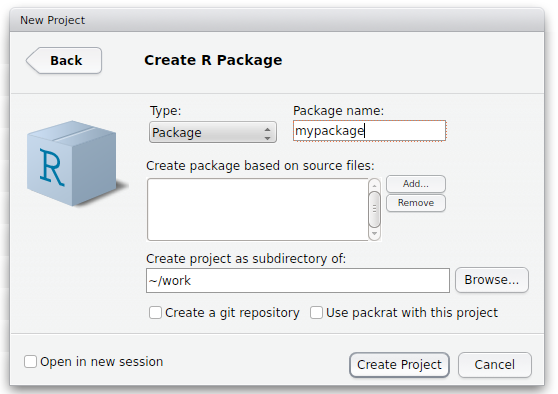

## Why R packages?

Makes your code:

* Easier to manage

* Easier to reuse

* Easier to share

---

## Overview

1. What is an R package?

1. Your first R package

2. Developing R packages using RStudio

---

## What is an R package?

"Packages are the fundamental units of reproducible R code." (Hadley Wickham)

"R packages are the best way to distribute R code and documentation…" (Karl
Broman)

---

## R functions (refresher)

**Functions** are an even more 'fundamental unit' than packages

The simplest way to 'package up' some R code

---

## Example

.tight Define a function:

```{r}
# Calculate the square of x.
square <- function(x)
    x^2
```

.tight Use the function:

```{r}
square(1:3)
```

---

## An R package is…

…a standard way to 'package up' R functions together

R code ➔ functions ➔ packages

---

## `functions.R`, the poor man's R package

1. Place function definitions in a file called `functions.R`

2. Load this in other scripts using `source("functions.R")`

---

## Examples

.tight In `functions.R`:

```
# Calculate the square of x.
square <- function(x)
    x^2
```

.tight In your R session:

```{r}
source("functions.R")
square(1:3)
```

---

## Examples

.tight In `functions.R`:

```{r eval=FALSE}
# Resample values from a given vector.
resample <- function(x, ...)
    x[sample.int(length(x), ...)]
```

.tight In your R session:

```{r}
source("functions.R")
resample(letters[1:10])
```

---

## Note: only need to `source()` once

.tight In your R session:

```{r}
source("functions.R")
square(1:3)
resample(letters[1:10])
```

--- .segue .quote

Hilary Parker:

<q>I really should just make an R package with these functions so I don't have
to keep copy/pasting them like a goddamn luddite.</q>

---

## Your first R package

Create folder structure

```
mypackage/
└── R/
```

---

## Your first R package

Move `functions.R` into the `R` subfolder

```
mypackage/
└── R/
    └── functions.R
```

---

## Your first R package

Create the `DESCRIPTION` and `NAMESPACE` files

```
mypackage/
├── R/
│   └── functions.R
├── DESCRIPTION
└── NAMESPACE
```

&nbsp;

Note: RStudio will automatically create these files

---

## Your first R package

Your `DESCRIPTION` file should look similar to:

```
Package: mypackage
Title: This is my first R package
Description: This package was created as a way to learn how to write
    R packages.
Authors@R: person("Damjan", "Vukcevic", email = "damjan@vukcevic.net",
                  role = c("aut", "cre"))
Version: 0.1
Depends: R (>= 3.3.1)
License: GPL-3
LazyData: true
```

---

## Your first R package

Your `NAMESPACE` file should look like:

```
# Export all names
exportPattern("^[[:alpha:]]+")
```

&nbsp;  
&nbsp;  
&nbsp;  
&nbsp;

Now, let's do all of this in RStudio…

---

## RStudio: Starting a new package

1. File > New Project… > New Directory > R Package > (dialog box) >
   Create Project

    

2. Edit the `DESCRIPTION` file
3. Edit your code

---

## RStudio: Working on your package

1. Edit your code
2. Build > Build and Reload  
   (**Ctrl/Cmd + Shift + B**)
3. Try running your functions in the **Console**
4. Repeat until happy

---

## Using your package

Simply use `library(mypackage)` instead of `source("functions.R")`

.tight For example:

```{r include=FALSE}
# Remove previous definitions to avoid messages for the next code block.
rm(resample, square)
```

```{r}
library(mypackage)
square(1:3)
resample(letters[1:10])
```

---

## Tip for larger packages

You can split up your code into any number of `.R` files

```
mypackage/
├── R/
│   ├── resample.R
│   └── square.R
├── DESCRIPTION
└── NAMESPACE
```

.tight All `.R` files within the `R` subfolder will automatically be included
in your package

(More convenient than if `source()`-ing)

---

## Benefits of packages (vs `functions.R`)

* Easier to reuse
* Easier to share
* Easier to maintain as complexity increases
* Cleaner project code

&nbsp;

And also (not covered today):

* Better documentation
* Easier automated testing
* Dependency and namespace management

---

## More info

### Slides for this talk

https://dvukcevic.github.io/rpkgs-talk-resbaz2018/

### More advanced guide for writing R packages

https://dvukcevic.github.io/rpkgs-talk/

### Contact me

**Web** - http://damjan.vukcevic.net/

**Email** - damjan@vukcevic.net

**Twitter** - [@VukcevicD](https://twitter.com/VukcevicD)

---

## Challenge problems

### Challenge 1

Write an R package called `challenge1` that contains the functions `square()`
and `cube()` which respectively square or cube an input number.

### Challenge 2

Write an R package called `challenge2` that contains the functions
`fullname()` and `sentence()` that behave as follows:

* `fullname()` combines two input strings into a single string, for example:  
  `fullname("Damjan", "Vukcevic")` should return `"Damjan Vukcevic"`.

* `sentence()` takes two input strings and returns a sentence, in this form:  
  `sentence("Damjan", "Vukcevic")` should return `"The name Damjan Vukcevic
  contains 14 characters"`.

Hint: use `paste()` and `nchar()`
